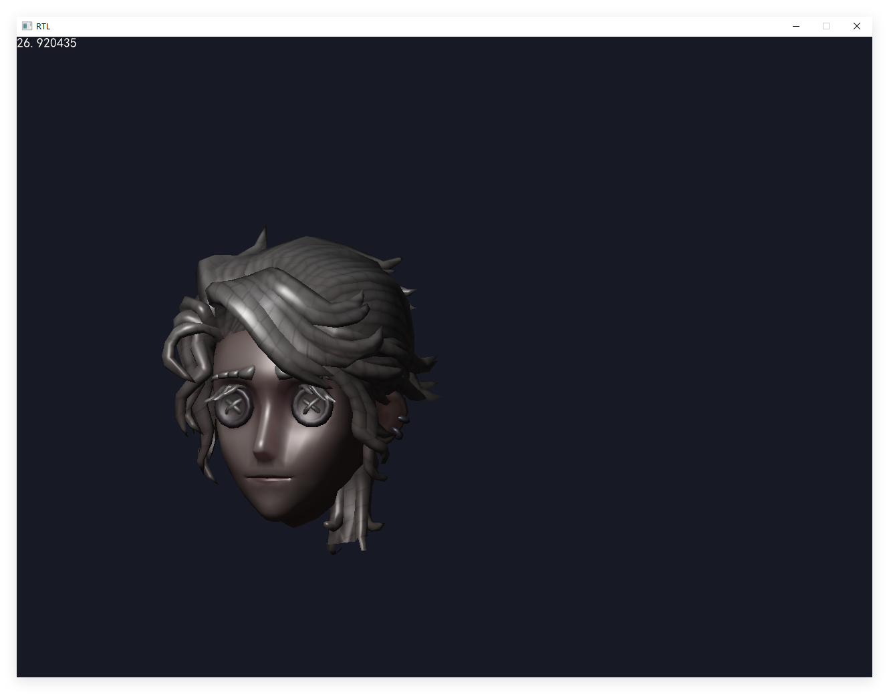
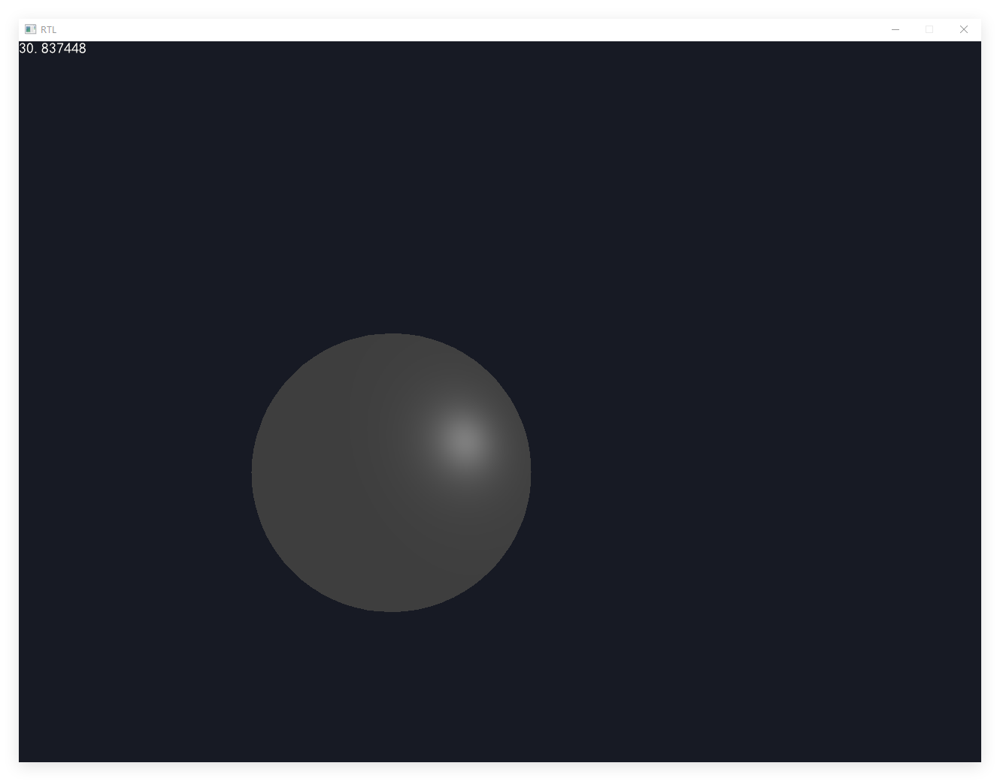
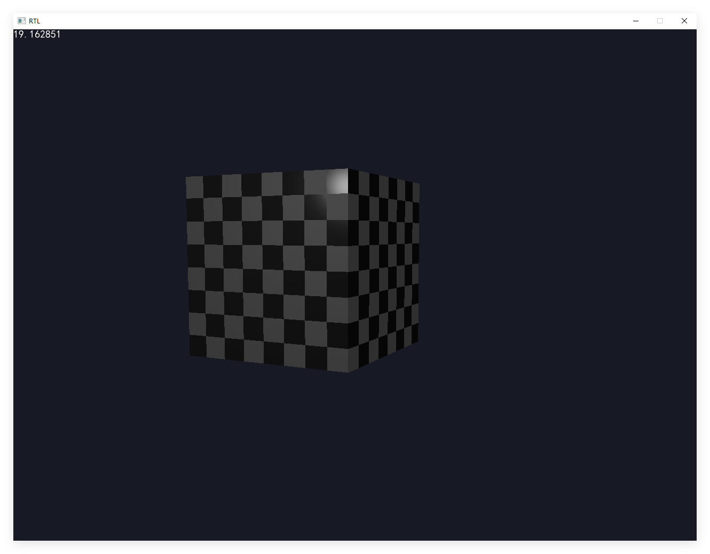
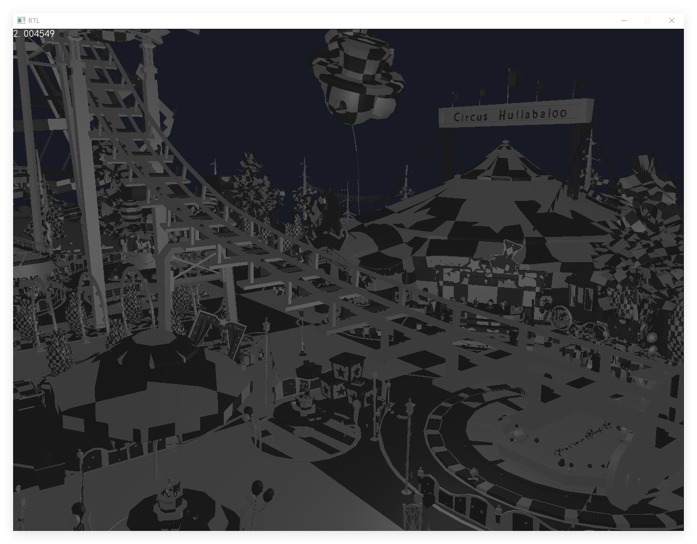

# RTL
### 介绍
`RTL` 是一个在 `Windows` 平台使用 `C++` 编写的软件光栅渲染器

借鉴了 [`0bao/RGS`](https://github.com/0bao/rgs) 的软件架构，实现了基本的渲染功能：

 - 解析 `OBJ` 文件 
 - 渲染 `三角形`
 - `PBR 材质` `Blinn-Phong 光照模型` `贴图`
 - `WASD` 控制相机移动 `鼠标` 控制相机旋转
 - 支持自写 `Shader`
 - 支持 `多线程` 渲染

### 使用方法

##### 运行环境

```
CPU : Intel E5-2673 v3
操作系统 : Windows 10
编译器 : MSVC 2019
```

#### 下载 `Build` 版本
点击 `Code` 下的 `Download ZIP` 下载最新版本的 `RTL` 压缩包
解压后在 `RTL\build\x86 or x64-Release` 目录下运行 `RTL.exe` 即可

#### 自行构建

```
git clone https://github.com/phigrostl/RTL.git  // 克隆项目
cd RTL                                          // 进入项目目录
mkdir build                                     // 创建构建目录
cd build                                        // 进入构建目录
cmake .. --DCMAKE_BUILD_TYPE=Release            // 配置项目
cmake --build . --config Release                // 构建项目
cd x86 or x64-Release                           // 进入Release目录
.\RTL.exe                                       // 运行RTL
```

#### 使用 `VS2019` 编辑代码
```
git clone https://github.com/phigrostl/RTL.git  // 克隆项目
cd RTL                                          // 进入项目目录
mkdir build                                     // 创建构建目录
cd build                                        // 进入构建目录
.\RTL.sln                                       // 打开VS2019项目
```

### 效果
 - `Blinn-Phong` 光照模型
 <div>
	
 </div>
 > 来源 : [第五人格模型](https://id5.163.com/nrzx/role.html)

 - `PBR` 光照模型
 <div>
	
 </div>

 - `PBR` 材质贴图
 <div>
	
 </div>

 - `PBR` 大模型
 <div>
	
 </div>
 > 来源 : 第五人格 由[`忌涼`](https://www.aplaybox.com/details/model/ycCmx2yWejb8)提取
 