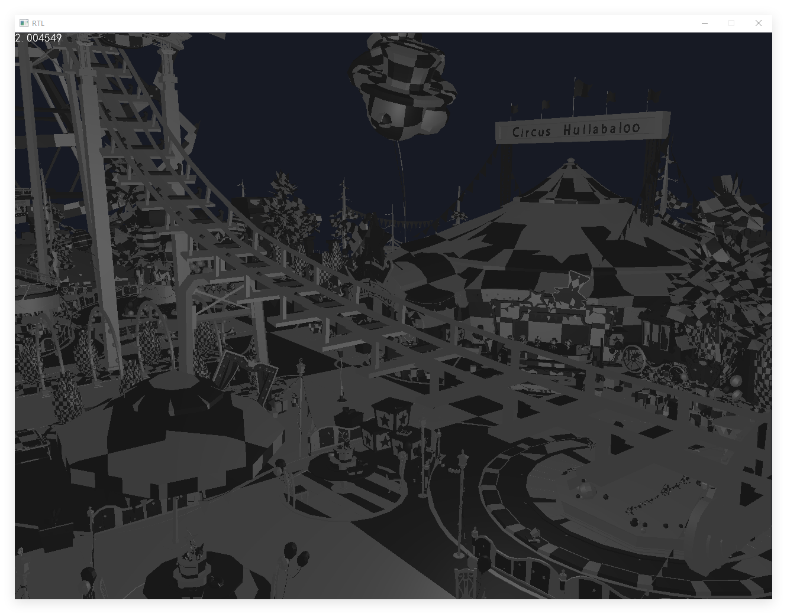

# RTL
> [中文](./README.md)
### Introduction
`RTL` is a software rasterizer written in `C++` for the `Windows` platform.


It draws inspiration from the software architecture of [`0bao/RGS`](https://github.com/0bao/rgs) and implements basic rendering functions:


- Parsing `OBJ` files
- Rendering `triangles`
- `PBR materials`, `Blinn-Phong lighting model`, `textures`
- `WASD` to control camera movement, `mouse` to control camera rotation
- Support for custom `Shaders`
- Support for `multi-threaded` rendering


### Usage


##### Operating Environment


```
CPU: Intel E5-2673 v3
Operating System: Windows 10
Compiler: MSVC 2019
```


#### Download the `Build` Version
Click `Download ZIP` under `Code` to download the latest version of the `RTL` compressed package.
After unzipping, run `RTL.exe` in the `RTL\build\x86 or x64-Release` directory.


#### Build It Yourself


```
git clone https://github.com/phigrostl/RTL.git  // Clone the project
cd RTL                                          // Enter the project directory
mkdir build                                     // Create a build directory
cd build                                        // Enter the build directory
cmake .. --DCMAKE_BUILD_TYPE=Release            // Configure the project
cmake --build . --config Release                // Build the project
cd x86 or x64-Release                           // Enter the Release directory
.\RTL.exe                                       // Run RTL
```


#### Edit Code with `VS2019`
```
git clone https://github.com/phigrostl/RTL.git  // Clone the project
cd RTL                                          // Enter the project directory
mkdir build                                     // Create a build directory
cd build                                        // Enter the build directory
.\RTL.sln                                       // Open the VS2019 project
```


### Effects
- `Blinn-Phong` Lighting Model
> Source: [Identity V Model](https://id5.163.com/nrzx/role.html)
<div>
	
</div>


- `PBR` Lighting Model
<div>
	
</div>


- `PBR` Material Textures
<div>
	
</div>


- `PBR` Large Model
> Source: Identity V, extracted by [`Ji Liang`](https://www.aplaybox.com/details/model/ycCmx2yWejb8)
<div>
	
</div>
